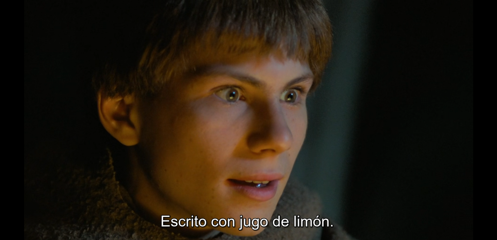

<div align="center">


# Lemon Juice

_Escrito con jugo de limón._

[](https://www.gnu.org/licenses/gpl-3.0.html)


</div>

> _Ah, yes. Written with lemon juice._
>
> — William of Baskerville, _The Name of the Rose_ (1986)

A Firefox extension that holds a web page up to the flame. It reveals **SOME**
hidden text and prompt-injection payloads: the writing an AI assistant would
read but you can't see. That way you can decide before you hand the page to
ChatGPT, Claude, Gemini, or a browser agent.

Click the toolbar icon and Lemon Juice surfaces invisible Unicode, ASCII
smuggling, visually hidden text, encoded blobs, and instruction-like phrases.
Each hit is highlighted on the page and listed in the popup.

> [!IMPORTANT]
> This is a detection aid, not a shield. It does not sit between the page and
> your AI assistant and it does not "clean" anything. It gives _you_ eyes on
> content that's otherwise invisible. A clean scan means "nothing obvious
> found," not "this page is safe," especially given this project's early stage
> (see [What this is and isn't](#what-this-is-and-isnt) and
> [Limitations](#limitations-please-read-before-trusting-it)).

## Why this exists

Indirect prompt injection (hiding instructions a human can't see so that an AI
reading the page ingests and obeys them) is ranked **LLM01, the single highest
risk** in the [OWASP Top 10 for LLM Applications](https://genai.owasp.org/llmrisk/llm01-prompt-injection/).
It's now documented in the wild against real AI agents.

The browser is where most of us actually meet this threat: we paste articles,
summarize pages, and point agents at sites we don't control. Yet on Firefox the
only existing tooling is a single narrow zero-width-character add-on. This project
aims to be a well-scoped, **honestly-described** scanner for the whole
hidden-text surface, not another "5 stars, 12 users, no idea if it works"
listing.

**Why Firefox first?** I use Firefox day to day and wanted this tool there.
If you're pointing a browser agent or automation pipeline at untrusted pages,
Chrome is worth a look too: automation-protocol tooling for it is far more
mature, and most agent frameworks target it first. A Chrome port is on the
[roadmap](#roadmap).

## Why "Lemon Juice"?

In _The Name of the Rose_, a monk hides a deadly secret by writing it on a
parchment in lemon juice: invisible until someone holds the page over a flame
and the heat brings the words out. Six centuries later, attackers hide
instructions on web pages in invisible Unicode and zero-width characters: writing
a human can't see, but that an AI reads and obeys. This extension is the candle.
It doesn't act on the hidden text or "clean" it. It just makes it visible and
leaves the judgment to you. William of Baskerville would approve: he trusted his
own eyes over the Devil that everyone else was so sure they saw.

<p align="center">
  
  
</p>

## What it detects

| Category                         | Examples                                                                                                                                                                                                                                                     | Severity            | OWASP scenario  |
| -------------------------------- | ------------------------------------------------------------------------------------------------------------------------------------------------------------------------------------------------------------------------------------------------------------ | ------------------- | --------------- |
| **ASCII smuggling**              | Invisible Unicode Tags block (`U+E0000–E007F`) carrying a full hidden ASCII payload; the popup decodes it                                                                                                                                                    | High                | #2 Indirect     |
| **Bidi controls**                | RTL/LTR overrides & isolates that reorder or hide text ("Trojan Source")                                                                                                                                                                                     | High                | #2 Indirect     |
| **Zero-width & invisible chars** | ZWSP, word joiner, BOM, soft hyphen, etc.                                                                                                                                                                                                                    | Medium/Low          | #2 Indirect     |
| **Visually hidden text**         | 1px fonts, `opacity:0`, off-screen positioning, text-color-equals-background                                                                                                                                                                                 | Medium              | #2 Indirect     |
| **Encoded blobs**                | Base64 runs that decode to readable text                                                                                                                                                                                                                     | Medium              | #9 Obfuscation  |
| **Instruction phrases**          | "ignore previous instructions", `system:`, "you are now", including obfuscations: leetspeak, math-bold/fullwidth/fraktur/script/monospace/sans-serif text, spaced letters, pipe-delimiters, 🚫-for-ignore substitution, emoji regional-indicator homoglyphs | Low (informational) | #1 Direct-style |

Severity reflects _how likely a pattern is to be an attack vs. a legitimate
feature_. Bidi overrides and the Tags block are essentially never innocent in web
copy; zero-width joiners are legitimate in Arabic/Indic scripts and emoji, so they
score low. The instruction-phrase detector is **informational only** and never
raises overall severity on its own. It false-positives on any page _about_ prompt
injection (including the OWASP page and this README).

## What this is and isn't

OWASP's LLM01 prevention strategies are aimed almost entirely at the **LLM
application developer**: constrain model behavior, validate output formats,
enforce least privilege, keep a human in the loop. A browser extension on the page
can't do any of those. What it _can_ do maps to one-and-a-half of them:

- **#6 Segregate and identify external content**: surface the untrusted/hidden
  content so a human notices it before feeding the page to an assistant.
- A client-side sliver of **#3 Input filtering**: flag known obfuscation vectors.

So the honest scope is: **reveal what an AI would ingest but you can't see.**
Detection is not interception. This tool does not protect an autonomous agent that
acts without you looking. For that, the defenses have to live inside the
assistant/agent itself, which every major vendor concedes is not fully solvable.

This also means **Lemon Juice only helps when a human is watching**: it runs
on click, so it never sits inside an agent's own browsing loop.

For unattended agents, the defense has to live in the agent itself.
[Claude for Chrome](https://www.anthropic.com/research/prompt-injection-defenses)
is one example: it classifies prompt injection hidden in text, images, and
deceptive UI, and Anthropic's own
[guidance for using it](https://support.claude.com/en/articles/12902428-use-claude-in-chrome-safely)
layers on permission prompts, human-in-the-loop review, minimal site access,
and keeping agents out of banking/email sessions.

None of it is bulletproof. ShadowPrompt, a browser-extension messaging bug,
let attackers inject prompts directly and sidestep those defenses entirely
before Anthropic patched it. No vendor claims prompt injection is solved.

**Treat Lemon Juice as a supplement for when you're reading, not a safety net
for when you're not.**

## Install

**From AMO:** _(coming once v0.1 is published)_

**From source (temporary add-on):**

1. Clone this repo.
2. Open `about:debugging#/runtime/this-firefox` in Firefox.
3. **Load Temporary Add-on…** and pick `manifest.json`.
4. The Lemon Juice icon appears in the toolbar. Open a page and click it.

> [!NOTE]
> Temporary add-ons are removed when Firefox restarts; reload from
> `about:debugging` to bring it back during development.

## Development

Buildless: plain ES, no bundler, no transpile step. Load the source directly.

```sh
pnpm install
pnpm test        # unit tests for detectors.js (pure, DOM-free)
pnpm lint        # eslint + prettier
```

`detectors.js` is deliberately free of any `document`/`window` access, so the
detection logic tests in Node with no DOM harness. Add cases to
`__tests__/detectors.test.js` when you add a detector.

## Architecture

| File                      | Role                                                                                                                                                                      |
| ------------------------- | ------------------------------------------------------------------------------------------------------------------------------------------------------------------------- |
| `detectors.js`            | **Pure** detection logic. String in, findings out. No DOM. Exposed as `globalThis.PIScanner` (for injection) and `module.exports` (for tests). This is the testable core. |
| `scan.js`                 | The DOM side. Walks text nodes, runs the detectors, adds the CSS-hidden-text heuristic, highlights hits, and stashes a serializable summary on `window.__PIScanResult`.   |
| `popup.js` / `popup.html` | Injects `detectors.js` then `scan.js` into the active tab on open, reads the summary back, renders findings, sets the toolbar badge.                                      |
| `manifest.json`           | MV3. Uses `activeTab` + `scripting` (inject-on-click) so it needs **no host permissions**.                                                                                |

> [!IMPORTANT]
> Injection order matters: `popup.js` runs
> `executeScript({ files: ["detectors.js", "scan.js"] })`, and `detectors.js`
> must load first so `PIScanner` exists when `scan.js` runs.

## Privacy

- **Nothing leaves your browser.** No network calls, telemetry, or analytics.
- **No host permissions.** `activeTab` grants access to a page only at the moment
  you click the icon, and only that page.
- All decoding and scanning happens locally in the page's content-script sandbox.

## Limitations (please read before trusting it)

> [!WARNING]
> This tool is honest about what it can't do, and it produces both false
> negatives and false positives. Highlighted ≠ malicious: it flags things for
> a human to judge, not the other way around.

Things the scanner will **miss**:

- **Payload splitting**: instructions across multiple DOM nodes (OWASP #6).
- **Adversarial suffixes**: high-entropy gibberish triggers (OWASP #8).
- **Multimodal / image-based payloads** (OWASP #7).
- **Server-side, URL-fragment, and dynamically-fetched content** not in the
  rendered DOM at scan time.
- **Any visible character breaking word boundaries**: emoji, symbols, or
  punctuation between words in an instruction phrase ("ignore 🔒 all previous
  instructions"). Only 🚫 substituting for "ignore"/"disregard" is individually
  patterned; other negation symbols (⛔, ❌, 🙅, etc.) are not.
- **Unicode homoglyph blocks not yet normalized** — double-struck, circled,
  parenthesized, superscript/subscript, small caps, and other decorative letter
  forms pass through undetected.
- **Emoji-only instructions**: pictograph sequences conveying a message
  visually (e.g. 👁‍🗨🚫📋↔🗑) are invisible to text-pattern scanning.
- **Compound obfuscation**: multiple obfuscation layers applied together can
  push normalized text beyond what the deobfuscation pipeline reconstructs.

You'll also get **false positives** from legitimate zero-width joiners in
Arabic/Indic scripts, `.sr-only` accessibility text, and any article discussing
prompt injection (including this README).

## Roadmap

- [x] `__tests__/detectors.test.js` with the full detector matrix
- [ ] Opt-in auto-scan on a user-configured domain list (requires per-site host permissions, kept off by default)
- [ ] Chrome port (swap the event page for a service worker, `browser.*` for a polyfill)

## Credits

- Attack taxonomy from [OWASP LLM01: Prompt Injection](https://genai.owasp.org/llmrisk/llm01-prompt-injection/).
- Prior art studied openly: **Stegano** (invisible-Unicode classifier) and
  **ZeroWidth-Detection-Firefox** by mikkel1156.
